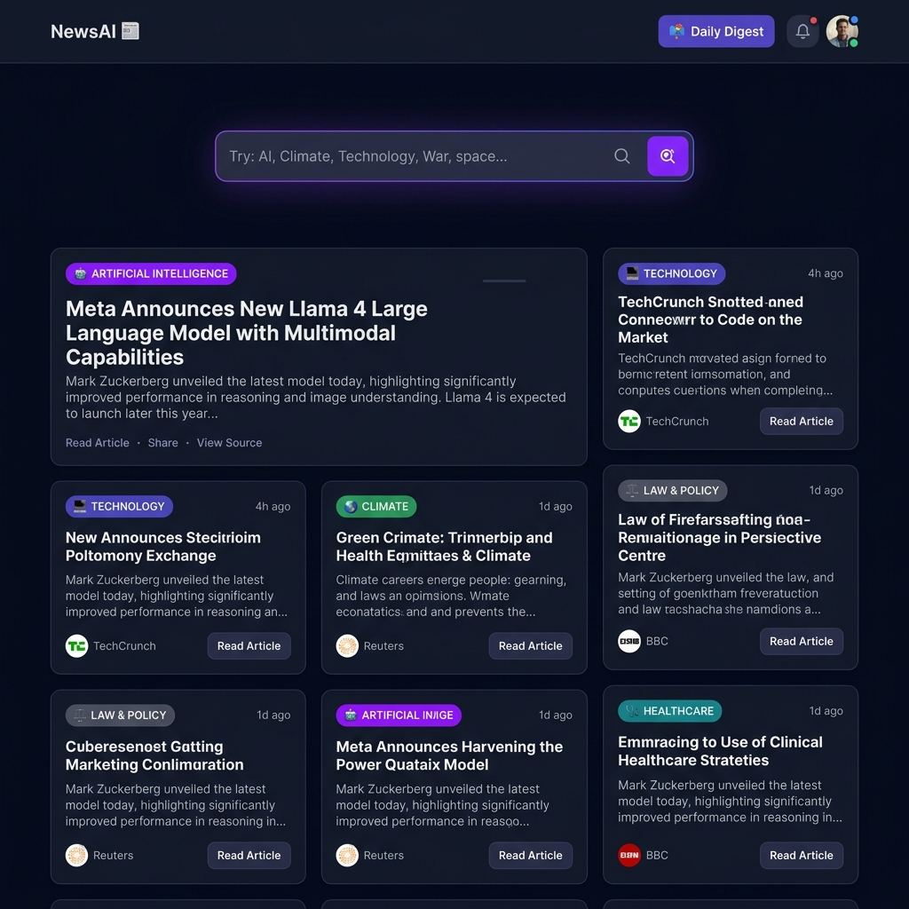
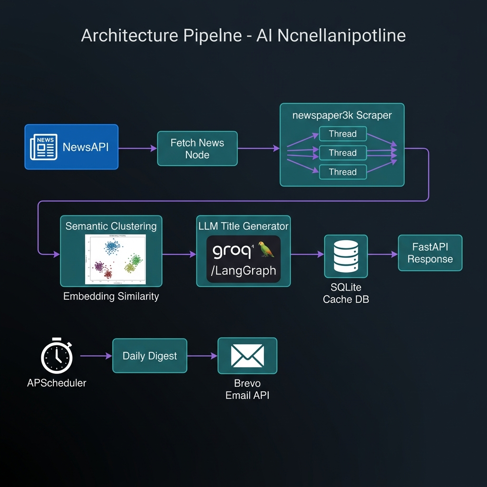
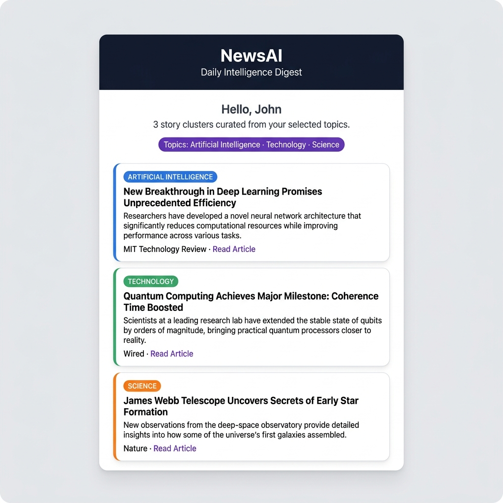

# 📰 NewsAI — AI-Powered Multi-User News Aggregator

<p align="center">
  
</p>

<p align="center">
  
  
  
  
  
</p>

> **NewsAI** is a full-stack, multi-user news aggregator that leverages **LangGraph** pipelines, semantic clustering, and Groq's LLMs to deliver curated, AI-summarised news clusters on any topic — plus automated daily digest emails to every subscriber.

---

## ✨ Features

| Feature | Description |
|---|---|
| 🔍 **Topic Search** | Search any topic and get the latest news articles fetched live from NewsAPI |
| 🤖 **AI-Powered Clustering** | Articles are semantically clustered using sentence-transformers so related stories are grouped automatically |
| ✍️ **LLM Title Generation** | Groq LLM generates a clean, meaningful headline and description for each story cluster |
| ⚡ **Smart Caching** | A 1-hour SQLite cache prevents redundant pipeline runs — repeat queries are served instantly |
| 👤 **Multi-User Auth** | JWT-based registration/login; every user gets their own search history and preferences |
| 📬 **Daily Digest Emails** | APScheduler fires at 08:00 UTC every day; users receive a personalised HTML digest via **Brevo** |
| 🗂️ **Topic Subscriptions** | Users subscribe to predefined topics (AI, Tech, Sports, Science…) for their digest |
| 📜 **Search History** | Per-user search history displayed in the sidebar |

---

## 🏗️ Architecture

<p align="center">
  
</p>

The backend is powered by a **LangGraph** state-machine pipeline that runs each step as a node:

```
User Request
     │
     ▼
┌─────────────────┐      cache HIT
│  Check Cache    │ ─────────────────────────────► FastAPI Response
└────────┬────────┘
         │ cache MISS
         ▼
┌─────────────────┐
│  Fetch News     │  ← NewsAPI (up to 20 articles)
└────────┬────────┘
         ▼
┌─────────────────┐
│  Scrape & Enrich│  ← newspaper3k (parallel, 10 threads)
└────────┬────────┘
         ▼
┌─────────────────┐
│  Cluster        │  ← sentence-transformers + cosine similarity
└────────┬────────┘
         ▼
┌─────────────────┐
│ Generate Titles │  ← Groq LLM (via LangChain)
└────────┬────────┘
         ▼
┌─────────────────┐
│  Save to DB     │  ← SQLite (accumulating cache)
└────────┬────────┘
         ▼
    FastAPI Response

── APScheduler (08:00 UTC daily) ──────────────────────────────────┐
   └─► Run pipeline per subscribed topic                           │
       └─► Assemble per-user digest (≤12 clusters)                │
           └─► Send HTML email via Brevo Transactional API  ◄──────┘
```

### Project Structure

```
NewsAI - AI News Aggregator/
├── fastapi_server.py        # FastAPI app + APScheduler startup
├── flask_server.py          # Flask server (serves frontend on :5000)
├── app.py                   # Flask app factory
├── main.py                  # Standalone CLI pipeline runner
│
├── api/
│   ├── auth.py              # /auth/register, /auth/login, /auth/me
│   ├── news.py              # /news/fetch, /news/history
│   └── daily.py             # /daily/run (manual trigger)
│
├── pipeline/
│   └── graph.py             # LangGraph pipeline (StateGraph)
│
├── scheduler/
│   └── daily_digest.py      # Digest assembly + Brevo email sender
│
├── database/
│   ├── db.py                # SQLite connection + schema init
│   └── models.py            # All CRUD helpers + topic subscriptions
│
├── llm/
│   └── groq_service.py      # Groq LLM client setup
│
├── templates/
│   ├── base.html            # Jinja2 base layout
│   ├── feed.html            # Main news feed page
│   └── auth.html            # Login / Register page
│
├── static/
│   ├── style.css            # Full UI stylesheet
│   └── app.js               # Frontend JS (search, auth, digest drawer)
│
└── requirements.txt
```

---

## 📬 Daily Digest Email

<p align="center">
  
</p>

Every subscribed user receives a **personalised HTML newsletter** at 08:00 UTC with:
- Up to **12 story clusters** drawn from their chosen topics
- Colour-coded **topic pills** for quick scanning
- Per-article source attribution and publication date
- Direct **"Read Article"** links to the original sources

---

## 🚀 Getting Started

### Prerequisites

- Python 3.11+
- A [NewsAPI](https://newsapi.org/) API key
- A [Groq](https://console.groq.com/) API key
- A [Brevo](https://www.brevo.com/) (formerly Sendinblue) account + API key (for emails)

### 1. Clone & Install

```bash
git clone https://github.com/your-username/newsai.git
cd "NewsAI - AI News Aggregator"

python -m venv .venv
# Windows
.venv\Scripts\activate
# macOS/Linux
source .venv/bin/activate

pip install -r requirements.txt
```

### 2. Configure Environment Variables

Create a `.env` file in the project root:

```env
# News fetching
NEWS_API_KEY=your_newsapi_key_here

# Groq LLM
GROQ_API_KEY=your_groq_api_key_here

# JWT Auth
SECRET_KEY=your_super_secret_jwt_key_here

# Brevo (transactional email)
BREVO_API_KEY=your_brevo_api_key_here
BREVO_SENDER_EMAIL=noreply@yourdomain.com
BREVO_SENDER_NAME=NewsAI Digest
```

### 3. Run the Backend (FastAPI)

```bash
python fastapi_server.py
# API available at: http://localhost:8000
# Swagger docs at:  http://localhost:8000/docs
```

### 4. Run the Frontend (Flask)

Open a second terminal:

```bash
python flask_server.py
# UI available at: http://localhost:5000
```

---

## 🔌 API Reference

| Method | Endpoint | Auth | Description |
|--------|----------|------|-------------|
| `POST` | `/auth/register` | ❌ | Create a new user account |
| `POST` | `/auth/login` | ❌ | Login and receive a JWT |
| `GET`  | `/auth/me` | ✅ JWT | Get the logged-in user's profile |
| `POST` | `/news/fetch` | ✅ JWT | Fetch & cluster news for a topic |
| `GET`  | `/news/history` | ✅ JWT | Get the user's search history |
| `GET`  | `/daily/subscriptions` | ✅ JWT | Get current topic subscriptions |
| `POST` | `/daily/subscriptions` | ✅ JWT | Update topic subscriptions |
| `POST` | `/daily/run` | ✅ JWT | Manually trigger the digest |

Interactive docs: **`http://localhost:8000/docs`**

---

## 📋 Predefined Digest Topics

Users can subscribe to any of these 13 curated topics for their daily email:

| Topic | Emoji |
|-------|-------|
| Artificial Intelligence | 🤖 |
| Technology | 💻 |
| Politics | 🏛️ |
| War and Conflict | ⚔️ |
| Entertainment | 🎬 |
| Sports | ⚽ |
| Business and Finance | 📈 |
| Science | 🔬 |
| Health and Medicine | 🏥 |
| Climate and Environment | 🌍 |
| Space Exploration | 🚀 |
| Cybersecurity | 🔒 |
| Education | 📚 |

---

## 🛠️ Tech Stack

| Layer | Technology |
|-------|-----------|
| **Backend API** | FastAPI + Uvicorn |
| **Frontend Server** | Flask (Jinja2 templates) |
| **UI** | Vanilla HTML/CSS/JS (dark theme) |
| **AI Pipeline** | LangGraph (StateGraph) |
| **LLM** | Groq (`llama3` / `mixtral` models) |
| **News Source** | NewsAPI.org |
| **Article Scraping** | newspaper3k |
| **Embeddings** | sentence-transformers |
| **Clustering** | scikit-learn (cosine similarity) |
| **Database** | SQLite (via Python `sqlite3`) |
| **Auth** | JWT (python-jose) + bcrypt (passlib) |
| **Email** | Brevo Transactional Email API |
| **Scheduler** | APScheduler (BackgroundScheduler) |

---

## 🔒 Security Notes

- Passwords are hashed with **bcrypt** before storage — never stored as plaintext
- JWTs expire after **24 hours**
- CORS is restricted to `localhost:5000` (Flask frontend) only
- Change `SECRET_KEY` in `.env` before any deployment

---

## 📄 License

This project is for educational purposes as part of a **SmartBridge** internship program.

---

<p align="center">Built with ❤️ using LangGraph, FastAPI, and Groq</p>
